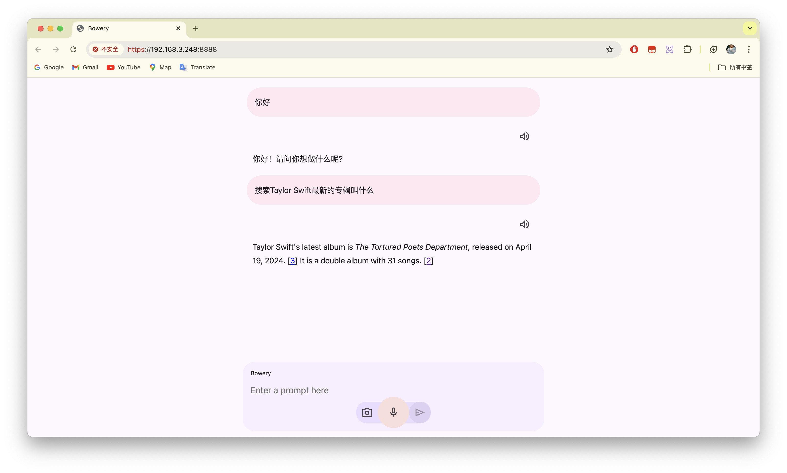
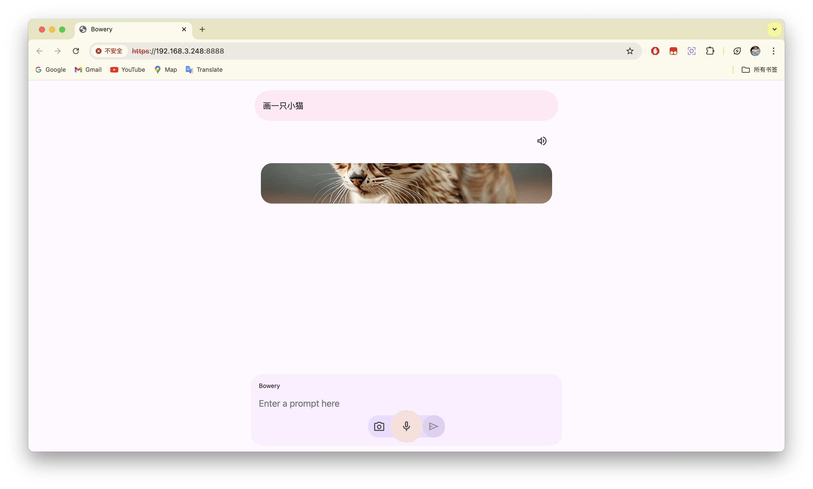
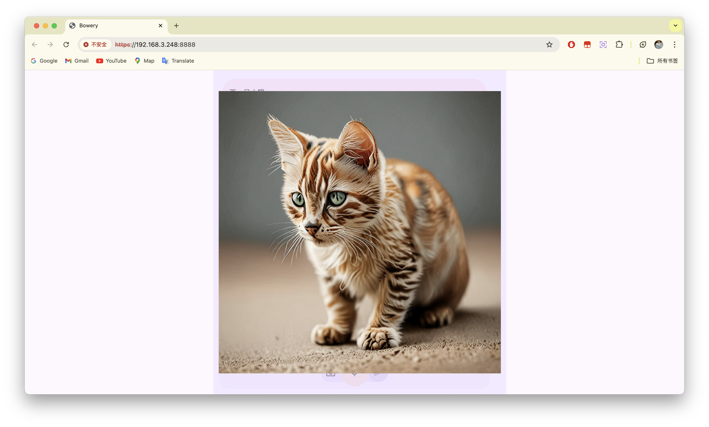

# Bowery

Bowery is an assistant based on the Gemini API and designed with Material You.

## Features
1. Speech Recognition
2. Image recognition
3. Search
4. Paint
5. TTS

## Screenshots

## How to use?

1. Clone the repo
2. Place server.crt and server.key in the `cert` directory
3. Replace `YOUR_API_TOKEN` with your Gemini API token in `config.py`
4. Replace `YOUR_API_TOKEN` with your Cloudflare AI token in `config.py`
5. run `pip install -r requirements.txt`
6. run `python main.py`
7. Use a mobile phone in the same LAN to access https://`the IP address of this device`:8888